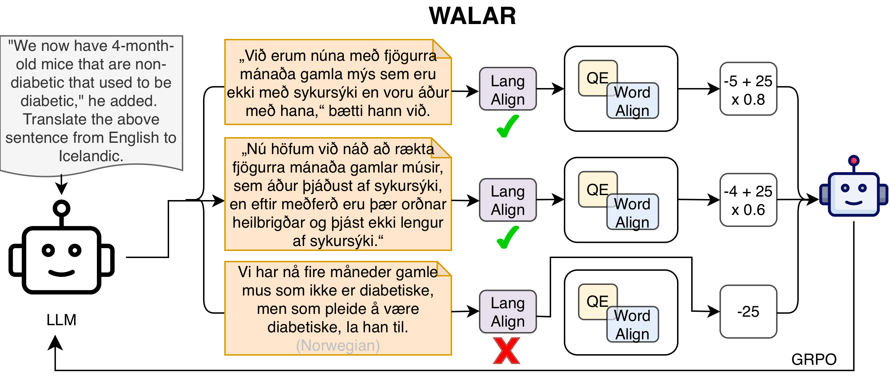
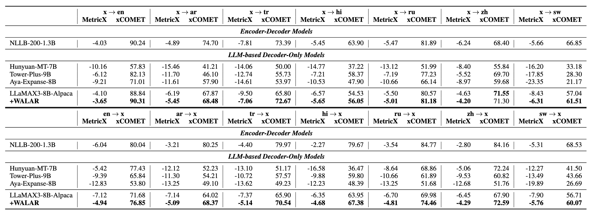
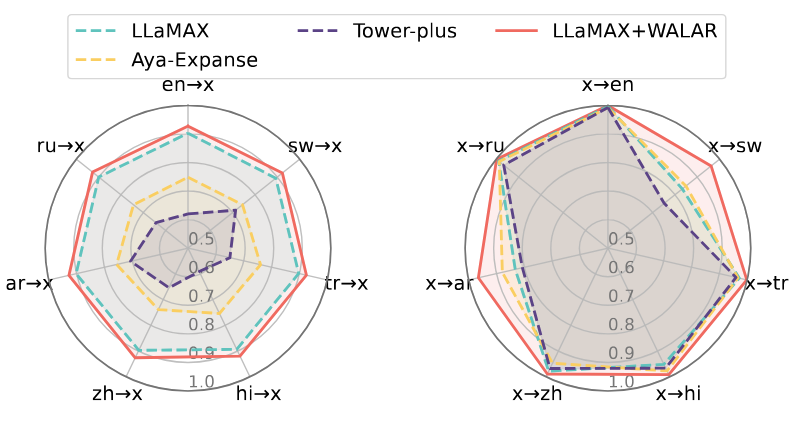
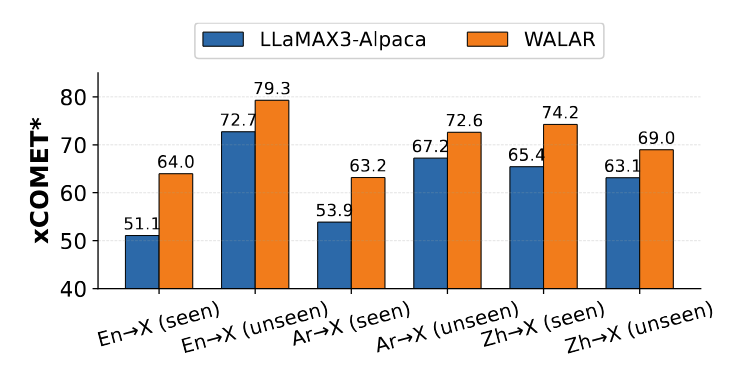

# Mending the Holes: Mitigating Reward Hacking in Reinforcement Learning for Multilingual LLMs

<p align="center">
  <a href="null"> 📃 Paper</a> | 
  <a href="https://github.com/LeiLiLab/qe-rl"> ⚙️ Code</a> | 
  <!-- <a href="https://huggingface.co/kevinpro/R-PRM-7B-DPO"> 🤖 Model</a> |  -->
  <a href="https://huggingface.co/datasets/kevinpro/R-PRM"> 🤗 Dataset</a> | 
  <a href="yfliu@smail.nju.edu.cn"> 📭 Contact</a> 
</p>


## Overview

We propose **WALAR**, a reinforcement training method using only monolingual text to elevate LLMs' translation capabilities on massive low-resource languages.  Our key insight is based on mending the holes of current state-of-the-art neural machine translation metrics, as training directly on these metrics will amplify such holes in trained LLMs. Specifically, we integrate quality estimation score, word alignment score and language alignment into WALAR's reward to mitigate the reward hacking brought by the holes. Finally, we trained an 8B LLM using WALAR. Extensive experiments on 1400 language directions demonstrate that our model outperforms the strongest prior multilingual model of the same size. 





## 📐 Experimental Results

### 📊 **FLORES-101**

We conducted extensive experiments on FLORES-101 and reported xCOMET and MetricX scores for over 1400 language directions. Results demonstrate that WALAR improves LLM translation quality by a large margin. Specifically, WALAR-trained LLaMAX demonstrated superior performance on 27 out of 28 reported metrics, including both English-centric and low-resource-centric translation directions.




### 🚀 LLM-as-a-Judge

We also conduct LLM-as-a-Judge using Gemini 3 Flash. Gemini 3 Flash demonstrated superior performance and earned first-place in WMT25 metric shared task. Results show that WALAR-trained LLaMAX outperforms the original model by a large margin across more than 1400 language directions.

| Directions                           | LLaMAX3-8B-Alpaca | WALAR     |
| ------------------------------------ | ----------------- | --------- |
| $\mathrm{en} \rightarrow \mathrm{x}$ | 54.87             | **62.14** |
| $\mathrm{ar} \rightarrow \mathrm{x}$ | 55.72             | **63.88** |
| $\mathrm{tr} \rightarrow \mathrm{x}$ | 55.06             | **63.67** |
| $\mathrm{hi} \rightarrow \mathrm{x}$ | 56.99             | **63.69** |
| $\mathrm{ru} \rightarrow \mathrm{x}$ | 58.87             | **65.39** |
| $\mathrm{zh} \rightarrow \mathrm{x}$ | 57.66             | **66.24** |
| $\mathrm{sw} \rightarrow \mathrm{x}$ | 52.36             | **60.07** |
| Avg                                  | 55.93             | **63.58** |


### 📄 Language Consistency

To systematically assess an LLM's ability to generate translations in the desired target language, we define the *Language Consistency Rate* (LCR) as the proportion of test instances whose outputs are identified as being in the correct target language. As shown in the figure below, WALAR also improves language consistency by a large margin, especially for low-resource target language, such as Swahili. 




### 📈Generalization of WALAR

Our model trained with WALAR also demonstrated strong generalization ability on language directions that are unseen during training. These results indicate that the improvements induced by WALAR can transfer beyond the training language set, potentially reducing the amount of parallel data and the number of language directions required to train massive multilingual models.





## 🔧 Training Guideline

### Step 0: Configure environment & Download models

**Configure the environment**

```
pip install -r requirements.txt
```


**Download Models**

LLaMAX: https://huggingface.co/LLaMAX/LLaMAX3-8B-Alpaca

MetricX: https://huggingface.co/google/metricx-24-hybrid-xxl-v2p6-bfloat16

MetricX Tokenizer: https://huggingface.co/google/mt5-xl

Masklid model: 

```
wget https://raw.githubusercontent.com/cisnlp/MaskLID/main/masklid.py
wget https://huggingface.co/cis-lmu/glotlid/resolve/main/model_v3.bin
```

Language Detector: https://huggingface.co/cis-lmu/glotlid

Word-alignment (Bge-m3): https://huggingface.co/BAAI/bge-m3

HanLP (Chinese tokenizer): https://file.hankcs.com/hanlp/tok/coarse_electra_small_20220616_012050.zip


### Step 1: Set up WALAR's Reward

**Prerequisite: 1 gpu needed**

Replace all the paths in `RewardModelProxy.__init__` with the models you downloaded in Step 0.


Run `bash serve_rm.sh`  under `scripts/`

```
bash serve_rm.sh
```


**Parameter Explanation**

* `model_name`: the Quality Estimation (QE) model you would like to use. Could be set to `metricX` or `XComet`

* `base_model`: the base model you want to evaluate. The paths for the models are hard-coded in line 517-526 in `openrlhf/openrlhf/cli/serve_rm.py`.
* `port`: The port of the reward model on your machine.
* `max_len`: The maximum input sequence length.
* `rule`: whether to penalize  `\n` in the translation outputs. Set `True` will give the lowest reward if `\n`  be generated in the output. (It's recommended to be True if and only if the qe model is a hybrid model)

* `lang_detect`: whether to turn on language detector or not. Set `True` to turn it on.

* `align`: whether to use word-alignment or not. Set `True` will turn it on.

* `masklid`: whether to mask the code-mixing part in the translation outputs. Set `True` will turn it on.
* `batch_size`: the batch size for the qe model to evaluate each time


### Step 2: Run RL

**Prerequisite: 4 or more gpus recommended**

Run `bash examples/scripts/train.sh `  under `openrlhf/`

```
bash examples/scripts/train.sh
```


**Parameter Explanation**

* `model`: The model you want to use. Please follow the `path_dict` in line 27-29. (You can add more models by directly modifying `path_dict`)
* `dataname`: The dataset you want to use. Please refer to the line 76 `prompt_data` for further info. (e.g., The dataset you want to use is called: `abc.jsonl`, then you simply set `dataname=abc`)
* `size`: The model size you want to use. You can set whatever you want. It won't affect the final results and it will only affect the name appears on your checkpoint directory and wandb.
* `reward_name`: The reward name you want to use.  You can set whatever you want. It won't affect the final results and it will only affect the name appears on your checkpoint directory and wandb.

For the usage of other parameters, please refer to the documnetation of OpenRLHF


**Hyperparameters**

* Batch Size: 1024
* Epochs: 1
* Learning Rates: `5e-7`
* Rollout Nums: 8
* Temperature: 1

